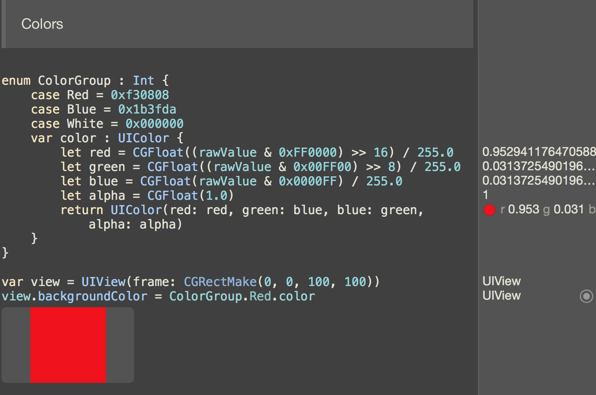
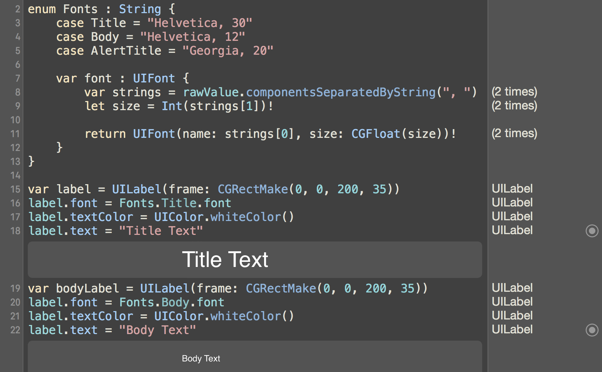
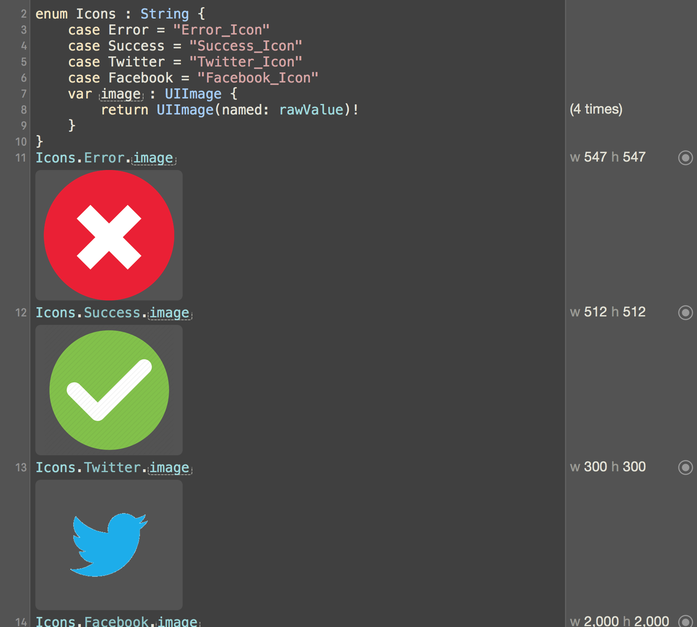

# Swiftly Typed Resources
A playground showing how Swift makes Strings, Colors, Fonts, Images, etc easier to deal with. Built with Xcode 7 beta 6.

####[Follow me on Twitter @iAmChrisTruman](https://twitter.com/iAmChrisTruman) 
## Colors

## Fonts

## Images

### Inspired by these projects:
* [Natalie](https://github.com/krzyzanowskim/Natalie)
* [SwiftGen](https://github.com/AliSoftware/SwiftGen)
* [SwiftRsrc](https://github.com/indragiek/swiftrsrc)
* [ObjC-CodeGenUtils](https://github.com/puls/objc-codegenutils)